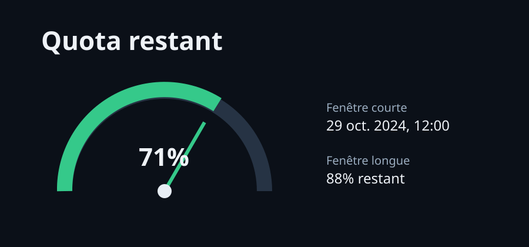

# Quota Codex

Une petite page locale qui affiche le quota restant et les dates de remise à zéro. Le navigateur ne reçoit jamais la clé de l’API. Le serveur la lit depuis son environnement et l’envoie au service configuré dans l’en-tête `X-API-KEY`.



## Démarrer

Node 20 ou plus récent suffit. Il n’y a aucune dépendance à installer.

```bash
cp .env.example .env
# édite .env et renseigne USAGE_API_URL et USAGE_API_KEY
set -a; source .env; set +a
npm start
```

Ouvre ensuite `http://localhost:3000`.

Le serveur attend une réponse JSON semblable à celle de l’endpoint d’usage Codex :

```json
{
  "plan_type": "plus",
  "rate_limit": {
    "limit_reached": false,
    "primary_window": { "used_percent": 29, "reset_at": 1730000000 },
    "secondary_window": { "used_percent": 12, "reset_at": 1730500000 }
  }
}
```

Il accepte aussi les champs `used_percent`, `reset_at`, `weekly_used_percent` et `weekly_reset_at` à la racine. La jauge représente la fenêtre courte. La couleur passe au jaune sous 25 %, puis au rouge sous 10 %.

## Configuration

`USAGE_API_URL` est l’URL complète du service de quota. `USAGE_API_KEY` est transmise au service sous le nom `X-API-KEY`. `PORT` est facultatif et vaut `3000` par défaut.

`.env` est ignoré par Git. Ne mets pas de clé dans `public/`, dans le README, dans les issues ou dans les variables de build qui produisent du JavaScript côté navigateur. Si la clé envoyée dans la demande a déjà été partagée ailleurs, révoque-la et crée-en une autre.

Le serveur limite les appels à dix secondes, refuse les redirections de l’API distante et ne met pas les réponses en cache. Il doit rester derrière un réseau de confiance ou une authentification si tu le déploies : l’interface elle-même n’ajoute pas de connexion utilisateur.

## Vérifier

```bash
npm test
```

Les tests ne font aucun appel réseau et ne nécessitent pas de clé.

## Scripts historiques

`show_codex_usage.sh` et `install.sh` restent dans le dépôt pour l’outil de terminal existant. Leur audit local est disponible dans [AUDIT.md](AUDIT.md).
